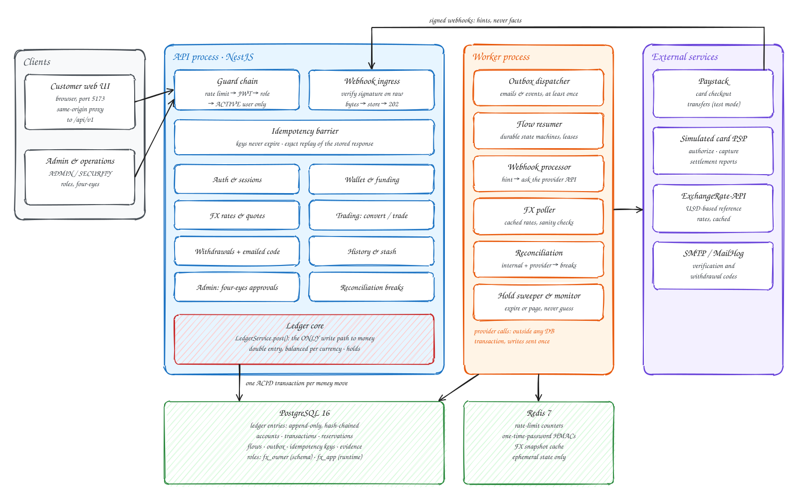

# Designing a Wallet and FX Trading Backend Ledger

A multi-currency wallet and FX trading backend built around a **double-entry ledger**. Customers fund a naira wallet
by card, hold NGN, USD, EUR and GBP, exchange between them at a quoted or market rate, and withdraw to a Nigerian bank
account. Every movement of money is a balanced, append-only, hash-chained ledger posting, and every external
interaction (payment provider, FX rates, email) is designed to survive crashes, retries, duplicate webhooks and
provider outages without losing or inventing money.

Three principles drive every design decision below:

- **No invented data.** Money only moves on an authoritative answer from the source of truth (the provider's API),
  never on a webhook, a cached guess or an elapsed timer.
- **No lost data.** Every fact is recorded durably before it is acted on; every flow can die between any two steps and
  be resumed.
- **No trust.** Inputs, webhooks, providers and even the application's own database role are treated as untrusted:
  the database enforces the invariants itself.

## Contents

- [Architecture](#architecture)
- [Features](#features)
- [Design decisions](#design-decisions)
- [Tech stack](#tech-stack)
- [Getting started](#getting-started)
- [Testing and CI](#testing-and-ci)
- [API](#api)
- [Project layout](#project-layout)
- [Known limitations and trade-offs](#known-limitations-and-trade-offs)
- [License](#license)

## Architecture



The diagram's source is [`docs/architecture.excalidraw`](docs/architecture.excalidraw): open it at
[excalidraw.com](https://excalidraw.com) (*Open* → choose the file) to edit it.

The system runs as **two processes** sharing one PostgreSQL database and one Redis:

| Process | Responsibility |
|---|---|
| **API** (NestJS, port 3000) | Authenticates and authorises requests, validates input, and records intent **inside the database only**: a funding, a quote, a conversion, a withdrawal. It never calls a payment provider while serving a request. Webhooks are verified on their raw bytes, stored, and acknowledged immediately. |
| **Worker** | Does everything that talks to the outside world, outside any database transaction: sends and verifies payments and transfers, polls FX rates, delivers emails, processes stored webhooks, expires holds and runs reconciliation. |

A request that moves money follows the same path every time:

1. **Guard chain**: rate limit → JWT authentication → role → an ACTIVE (verified, not suspended) user.
2. **Idempotency barrier**: the request's `Idempotency-Key` is claimed in the same transaction as the work; a retry
   with the same key replays the stored response byte for byte.
3. **Module logic** (funding, trading, withdrawals, …) prepares a balanced posting.
4. **`LedgerService.post()`**, the only code path that changes a balance, writes the entries in one ACID transaction.
5. Side effects (emails, provider calls) are written to an **outbox** in that same transaction and carried out later
   by the worker.

## Features

- **Accounts**: registration with email verification (one-time code), RS256 JWT access tokens and rotating refresh
  tokens with reuse detection.
- **Wallets**: per-currency balances showing total, reserved and available amounts, with currency precision
  (`minorUnit`) read from the database (NGN 2, JPY 0, KWD 3).
- **Funding**: card funding through a simulated PSP (authorize → capture → settle, chargebacks) and through
  **Paystack** checkout.
- **FX**: rates from ExchangeRate-API with freshness tiers; 30-second single-use quotes; market conversions and
  quoted trades with optional price protection.
- **Withdrawals**: to Nigerian bank accounts through **Paystack Transfers** (test mode). The bank account's name is
  resolved before it can receive money, and every withdrawal needs a **6-digit code emailed on request**. Confirmed
  withdrawals land in a **simulated bank ("stash")** as evidence of a completed payout.
- **History**: keyset-paginated history across postings, pending fundings and pending withdrawals.
- **Reconciliation**: internal ledger checks plus provider reconciliation (settlement reports, transfers), recording
  discrepancies as tracked *breaks*.
- **Controls**: ADMIN and SECURITY roles, **four-eyes approvals** for every sensitive action (corrections, write-offs,
  rate overrides, suspensions, period closes, withdrawal recovery), break-glass with mandatory review, and an
  audit trail.
- **Customer web UI** (`ui/`), a lightweight browser client with a sample-money preview mode.
- **OpenAPI contract**: Swagger UI at `/api/v1/docs`; the committed spec is verified against the running app in CI.

## Design decisions

### Money and the ledger

- **No floating point anywhere in the money path.** Amounts are stored as `BIGINT` minor units, computed with
  `decimal.js`, and sent over the wire as **strings** (`"150000"` NGN = ₦1,500.00). Provider responses are parsed
  losslessly, so a large JSON number is never rounded by JavaScript.
- **Double entry, balanced per currency.** NGN and USD legs never offset each other. A conversion posts up to five entries:
  the user's source debit, the FX position in both currencies, the user's target credit and the spread.
- **A customer balance is a liability** (money the business owes), and the accounting equation
  `assets = liabilities + equity + revenue − expenses` is checked continuously.
- **The spread is explicit revenue**, booked per trade to `REVENUE:FX_SPREAD:{currency}`, never hidden in a rounding
  residual.
- **Round once, at the boundary, with an explicit strategy**: user credits round down, user debits round up,
  revenue rounds half-even. Every residual is accounted for.
- **One write path to money.** Funding, conversion, withdrawal, reversal, correction, write-off and promotional credit
  all go through `LedgerService.post()`. Nothing else updates a balance.
- **Append-only and tamper-evident.** Ledger entries cannot be updated or deleted: database triggers raise, the
  runtime role has no such grants, and each entry is **hash-chained** to the previous one. Mistakes are corrected with
  new compensating postings, linked in both directions.
- **No `CHECK (balance >= 0)`.** A non-negative balance is a *policy* enforced when spending is authorised, against
  `available = balance − reserved`. A chargeback that arrives after the money was spent is still recorded and may
  push the balance negative: refusing the fact would lose data, and clamping it would mint money.

### Concurrency

- **Pessimistic locking, one transaction per money movement**, at `READ COMMITTED`: every affected account is locked
  with `SELECT … FOR UPDATE` in a **global lock order** (user, flow, user accounts ascending by id, reservations,
  internal accounts), so concurrent operations serialise instead of deadlocking.
- **`lock_timeout` 3 s and `statement_timeout` 10 s** surface contention as a retryable `503 RESOURCE_BUSY`, never a hung
  request.
- **Hot internal accounts are split into buckets** (64 rows per account and currency), so thousands of conversions
  don't queue behind one row.
- **Holds before spending.** A conversion or withdrawal first *reserves* the amount (`reserved` grows, `available`
  shrinks), then *settles* it with the actual posting. Losers of a race get `FUNDS_RESERVED` (the total covers it but
  money is held) or `INSUFFICIENT_FUNDS`.

### Idempotency

- **Every mutating money and admin route requires an `Idempotency-Key`**, and keys **never expire**.
- The key is claimed, the work done and the response stored in **one transaction**, so a committed request always has
  a stored response, and a crashed one leaves no key behind. A retry with the same key replays the exact stored bytes
  (`Idempotent-Replayed: true`); the same key with a different body is `409 IDEMPOTENCY_KEY_REUSE`.
- Permanent refusals (a 4xx) are stored and replayed; transient failures (503s) store nothing, so the client simply
  retries with the same key.
- Bodies that carry secrets (bank account numbers, withdrawal codes) are hashed with a **keyed HMAC**, never a plain
  SHA-256 that could be brute-forced from the table.

### External providers and webhooks

- **Never hold a database transaction open across a network call.** The API records intent; the worker calls the
  provider afterwards and commits the result in a separate, fenced transaction.
- **Webhooks are hints, not facts.** The signature is verified over the raw bytes, the payload is stored, the endpoint
  answers at once, and the worker then **asks the provider's API** for the authoritative state. Forged, replayed or
  out-of-order webhooks cannot move money.
- **Writes are sent once, reads are retried.** Provider writes carry the provider's own idempotency key or a stable
  reference; before re-sending, the flow first checks whether the earlier attempt already took effect.
- **Every provider call is recorded** (redacted request, exact response text, timing) as evidence for reconciliation.
- **A port per provider** (`PaymentProvider`, `PaystackTransfersGateway`, `RateProvider`), so a new provider is a new
  adapter, not a change to callers.

### Durable flows

- Fundings, beneficiary verification and withdrawals are **database-backed state machines**: every transition is
  checked by both TypeScript and an SQL trigger, which are tested against each other.
- **Assume every flow dies between any two steps.** A worker claims a flow with a **lease**; every commit re-checks
  the lease token (fencing), so a stalled worker that wakes up late cannot overwrite newer progress. An independent
  resumer picks up anything left behind.
- A flow **never gives up because time passed**. It fails only on a definitive answer from the provider. Money in
  flight is held, retried with backoff and, if stuck, raised to an operator.
- **Outbox pattern**: emails and domain events are written in the same transaction as the state change and delivered
  at least once by the worker, with idempotent handlers.

### FX rates and pricing

- **One provider behind a port, aggressively cached.** Rate requests never scale with user traffic: a per-process
  cache, then Redis, then the latest accepted database snapshot, and only then a single, rate-limited catch-up fetch.
- **Freshness is measured from the provider's publication time.** A stale rate may be **displayed** but never
  **executed against**.
- **Every fetch is sanity-checked** (bounds, completeness, jumps against the last accepted snapshot). A jump of more
  than 20% is never auto-accepted; it halts trading until an approved override.
- **Quotes lock the price**: amounts, rates, spread and the snapshot they came from are stored with the quote, and a
  trade posts them verbatim. Quotes are single-use and expire after 30 seconds.

### Withdrawals

- **Verify the destination before money can leave.** A bank account is resolved with the provider (the account name
  comes from the bank, not the user) and becomes READY only after a transfer recipient exists.
- **Step-up confirmation.** A withdrawal needs a **6-digit code** that the worker emails on request. The code is valid
  for 10 minutes and one withdrawal, five wrong tries use it up, and only its HMAC is ever stored.
- **Protected holds.** The amount is held when the withdrawal is accepted. A payout hold can't expire by itself: it
  is released only on evidence that the transfer definitively failed, and settled only on a matched, verified success.
- **Exactly-once completion.** The principal posting, the hold settlement and the stash receipt are written in one
  transaction, and only when the provider's verify endpoint confirms the exact transfer: reference, amount,
  currency, recipient and test domain. A later reversal is booked as an exact compensating posting plus a
  reversal receipt.
- **Personal data is encrypted.** Account numbers and resolved names are sealed with AES-256-GCM under per-user data
  keys (envelope encryption with rotatable key-encryption keys); customers only ever see the last four digits.

### Reconciliation

- **Internal checks** run in one consistent read-only snapshot: trial balance per currency, the accounting equation,
  cached balance = Σ entries, `balance_after` continuity, the hash chain, and reserved = Σ active holds.
- **External reconciliation** compares the ledger with the provider's settlement reports, payments, chargebacks and
  transfers, matching on the **provider's ids only**, never on amount and time.
- Discrepancies become **breaks** with a lifecycle (OPEN → ESCALATED → RESOLVED). A break is never "resolved" just
  because it disappeared; money breaks are fixed only by an approved correction.
- Runs are claimed with a lease and are resumable; an incomplete scan never reports CLEAN.

### Controls and security

- **Deny by default.** Every route requires authentication unless explicitly public, and every user-owned query is
  scoped to the caller in SQL. Another user's resource is the same `404` as one that doesn't exist.
- **Four-eyes by construction.** Sensitive actions are requested by one administrator and approved by another, and
  the database itself enforces that requester ≠ approver, the roles involved and the state machine. Approval executes
  the action in the approver's transaction, re-validating it against current data.
- **Database roles.** Migrations run as the schema owner; the application connects as a runtime role that cannot
  alter the schema, delete rows or rewrite evidence. Immutable columns are trigger-protected.
- **Sessions.** Short-lived RS256 access tokens carry identity only; status, role and revocation are re-read on every
  request, so logout and suspension take effect immediately. Refresh tokens rotate, and a reused token revokes the
  whole session family.
- **Passwords and codes.** argon2id password hashing; one-time codes exist in plaintext only in the worker that emails
  them; one uniform error for every failed login; rate limits instead of account lockout.
- **Fail loudly.** Broken assumptions raise instead of being clamped, swallowed or silently skipped.

## Tech stack

NestJS 11 · Node.js 20 · TypeScript (strict) · TypeORM · PostgreSQL 16 · Redis 7 · decimal.js ·
Jest + fast-check + testcontainers · Docker Compose (PostgreSQL, Redis, MailHog) · GitHub Actions.

## Getting started

**Prerequisites:** Node.js 20+, Docker.

```bash
npm ci
cp .env.example .env
npm run --silent secrets:generate >> .env   # development JWT keys, one-time-code pepper and key rings
docker compose up -d                        # PostgreSQL 16, Redis 7, MailHog
npm run migration:run                       # creates the schema (as the owner role)
```

Run each process in its own terminal:

```bash
npm run start:dev               # API              → http://localhost:3000/api/v1
npm run start:worker:dev        # worker (outbox, flows, webhooks, FX poller, reconciliation, monitors)
npm run start:ui                # customer web UI  → http://localhost:5173
```

Local simulators, so no real provider account is needed:

```bash
npm run start:mock-psp:dev      # simulated card PSP          → :4010  (PSP_BASE_URL=http://localhost:4010)
npm run start:mock-fx:dev       # simulated ExchangeRate-API   → :4020  (FX_RATE_BASE_URL=http://localhost:4020/v6/latest)
npm run start:mock-paystack:dev # simulated Paystack           → :4030  (PAYSTACK_BASE_URL=http://localhost:4030)
```

The Paystack simulator starts with bank accounts it can resolve, a balance and a transfer outcome, all configurable:
`MOCK_PAYSTACK_ACCOUNTS`, `MOCK_PAYSTACK_BALANCE`, `MOCK_PAYSTACK_TRANSFER_STATUS`, `MOCK_PAYSTACK_TRANSFER_FEE` (see
`.env.example`). Emails, including verification and withdrawal codes, appear in MailHog at http://localhost:8025.

Paystack funding and withdrawals are switched off by default. To enable them, set `PAYSTACK_ENABLED=true`, a test
secret key and the callback URL; for withdrawals also set `PAYSTACK_WITHDRAWALS_ENABLED=true`,
`PAYSTACK_ACCOUNT_IDENTITY` and `PAYSTACK_WITHDRAWAL_LIMITS`. Withdrawals refuse to start in production or with a
live key. [`docs/TESTING.md`](docs/TESTING.md) walks through a full manual test, including a real Paystack test-mode
checkout.

## Testing and CI

```bash
npm run typecheck
npm test              # unit and property-based tests
npm run test:int      # integration tests against real PostgreSQL and Redis (testcontainers; needs Docker)
npm run test:e2e      # the whole app end to end, including MailHog
```

The test strategy matches the risk:

- **Property-based tests** (fast-check) for money maths and ledger invariants, with an independent model as the
  oracle, checked after every step, not only at the end.
- **Integration tests on real PostgreSQL and Redis**, never mocks of the database: concurrency races (for example
  100 parallel conversions against one balance, where exactly one may win), crash injection between flow steps,
  stale leases, duplicate and forged webhooks.
- **Generative idempotency tests**: every mutating command is replayed and must have zero additional effect.
- **Query-plan tests** that `EXPLAIN` the real history and reconciliation queries to prove they use their indexes.
- **Contract tests**: the committed OpenAPI document must equal the running app's, and real responses are validated
  against it.

[GitHub Actions](.github/workflows/ci.yml) runs on every push and pull request to `develop` and `main`: typecheck,
build and unit tests, then integration tests split into four parallel shards, and end-to-end tests. No secrets are
needed: the tests generate their own keys and use local simulators for every provider.

## API

All routes live under `/api/v1`. With the API running, interactive documentation is at
http://localhost:3000/api/v1/docs (JSON at `/api/v1/docs-json`); the committed spec is
[`docs/openapi.json`](docs/openapi.json).

| Area | Routes |
|---|---|
| Auth | `POST /auth/register`, `/auth/verify`, `/auth/resend-otp`, `/auth/login`, `/auth/refresh`, `/auth/logout` |
| Profile | `GET /users/me` |
| Wallet and funding | `GET /wallet`, `POST /wallet/fund`, `POST /wallet/fund/paystack`, `GET /wallet/fund/{fundingId}` |
| FX and trading | `GET /fx/rates`, `POST /fx/quotes`, `GET /fx/quotes/{quoteId}`, `POST /wallet/convert`, `POST /wallet/trade` |
| Withdrawals | `GET /wallet/withdrawal-banks`, `POST`/`GET /wallet/withdrawal-beneficiaries[/{id}]`, `POST /wallet/withdraw/one-time-password`, `POST /wallet/withdraw/paystack`, `GET /wallet/withdraw/{withdrawalId}` |
| Stash | `GET /stash`, `GET /stash/transactions` |
| History | `GET /transactions`, `GET /transactions/{reference}` |
| Admin | `/admin/approvals` (request, approve, reject, cancel, review), positions, breaks, reconciliation runs, users, recertification |
| Webhooks | `POST /webhooks/psp`, `POST /webhooks/paystack` (signed, machine to machine) |
| Health | `GET /health/live`, `GET /health/ready` |

Conventions: amounts are strings of minor units; errors share one shape (`code`, `message`, `details`,
`correlationId`), and clients branch on the stable `code`; every response carries `X-Correlation-Id`.

## Project layout

```
src/
  common/          money, rounding, errors, guards, idempotency interceptor, HTTP client for providers, crypto
  database/        data source, migrations, UnitOfWork (transactions via AsyncLocalStorage)
  modules/
    ledger/        LedgerService.post(), chart of accounts, posting validation, integrity checks
    reservations/  holds: reserve, settle, release, expire
    auth/ users/   registration, verification, sessions, tokens, passwords
    flows/         durable state machines, leases, resumer; funding flows
    payments/      provider ports and adapters (simulated PSP, Paystack, transfers), webhooks
    fx/            rate fetching, freshness, sanity checks, pricing, quotes
    trading/       conversions and quoted trades
    withdrawals/   beneficiaries, withdrawal flow, withdrawal codes, protected-hold monitor
    stashes/       simulated bank receipts (read model)
    transactions/  history read model
    reconciliation/ internal and provider reconciliation, breaks
    admin/         roles, approvals (four-eyes), executors, admin read models
    outbox/ notifications/ audit/ protection/ health/
  mock-psp/ mock-paystack/ mock-exchange-rate-api/   local provider simulators (never imported by modules)
  main.ts worker.ts
test/              integration and e2e suites, harness, oracles
ui/                customer web UI and its same-origin proxy
docs/              architecture diagram, OpenAPI spec, manual testing guide
```

## Known limitations and trade-offs

- **Withdrawals are test-mode only.** They go through Paystack's test environment and land in a simulated bank. The
  payout balance has no evidenced treasury funding, so the reconciliation reports a treasury-evidence break every day
  instead of pretending the books are fully backed.
- **One FX provider.** There is no second source to cross-check rates; the jump and bounds checks are the mitigation.
- **Bank balances are only as accurate as the provider's settlement reports**; a bank-statement integration would be
  the next step.
- **Not built yet:** MFA and step-up authentication for administrators, daily per-user funding limits, partitioning of
  the largest evidence tables.

## License

[MIT](LICENSE)
